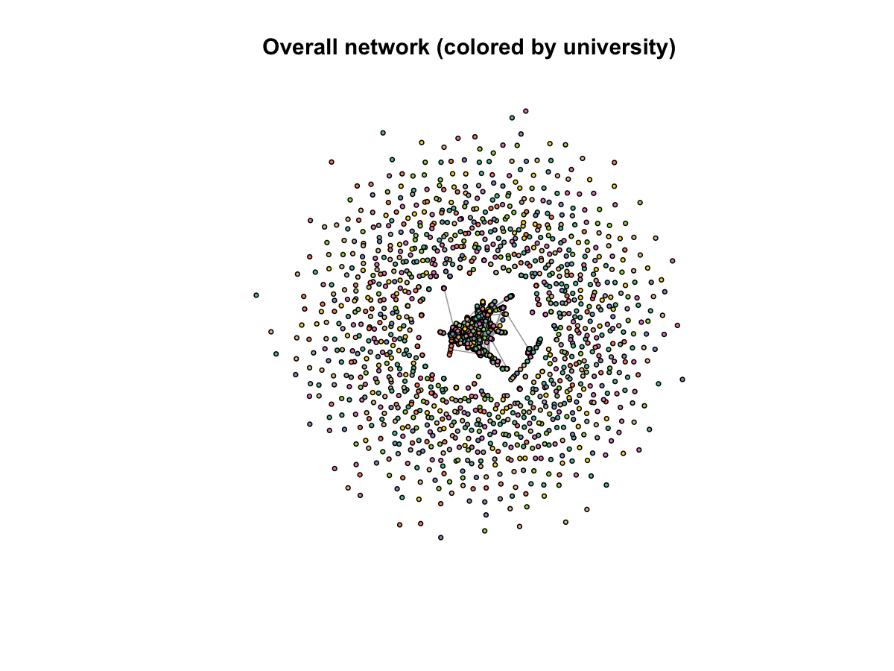
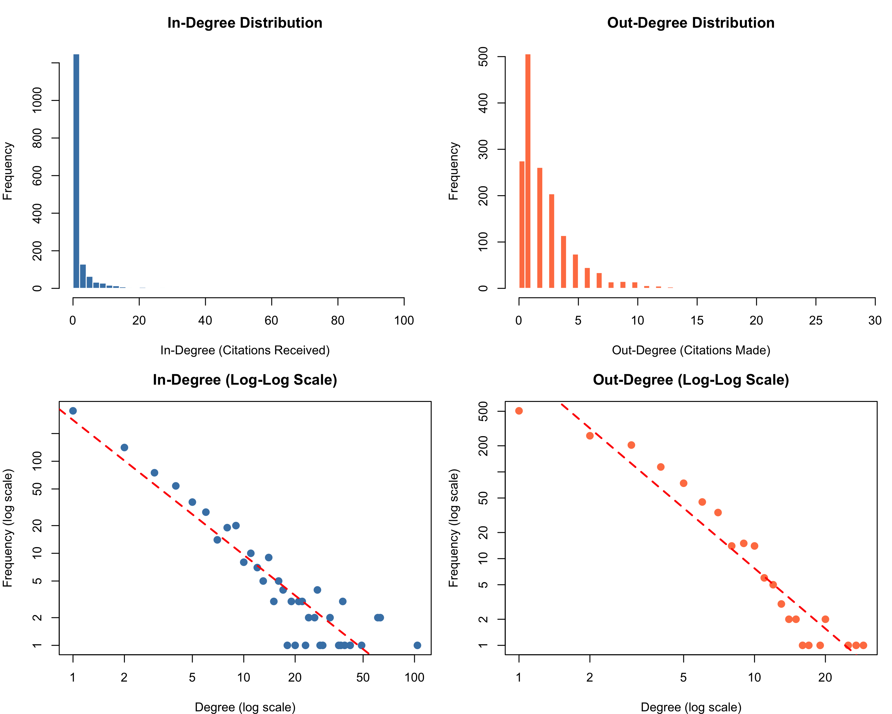
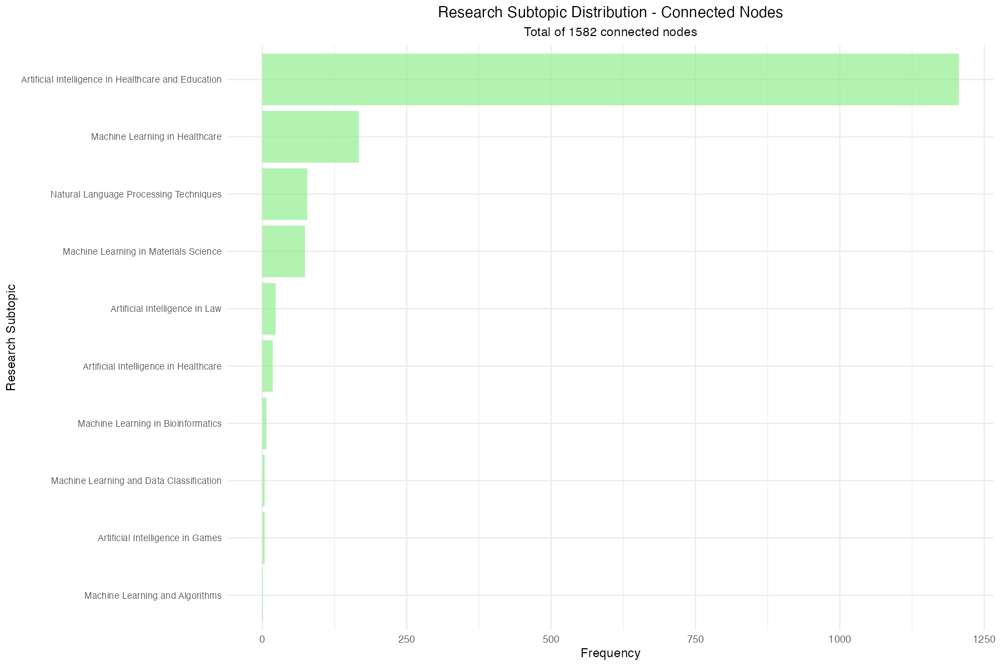
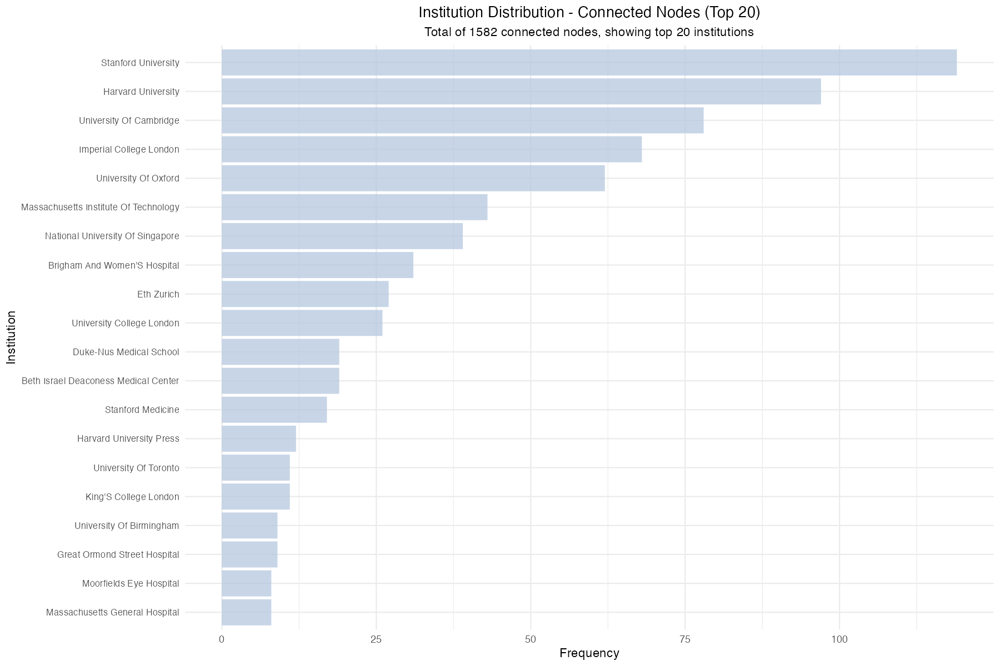
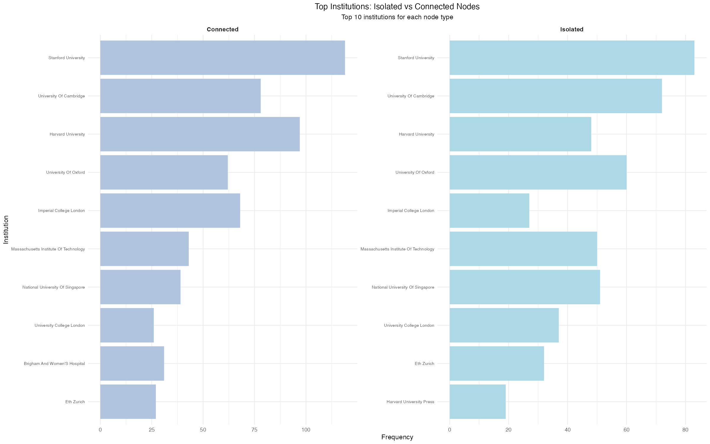

```{r setup, include=FALSE}
# Set knitr options
knitr::opts_chunk$set(
  echo = FALSE,
  warning = FALSE,
  message = FALSE,
  fig.align = 'center',
  fig.pos = 'htbp',
  out.width = '90%',
  dpi = 300
)

# Load required libraries
library(knitr)
library(kableExtra)
library(ggplot2)
library(dplyr)
library(tidyr)

# Don't change root directory - stay in Final Report/ where images are
# This allows knitr to find images in the same directory as the .Rmd file

# Define paths using absolute paths
project_root <- "/Users/johaneshp/Downloads/cosc421-final-project"
output_tables <- file.path(project_root, "output/tables")

# Images are in the same directory as this .Rmd file
output_plots <- getwd()
```


# Introduction

## Background and Motivation

Over the past decade, artificial intelligence has experienced unprecedented growth in both research output and practical applications. AI-related publications have increased globally by 57% from 2018 to 2022, making it one of the largest areas of research [@nature_ai_growth_2023]. At the same time, the organizational adoption of AI has surged from 55% to 72% between 2023 and 2024, with OpenAI reaching 800 million weekly users just last month [@mckinsey_ai_adoption_2024; @openai_usage_2024]. This rapid expansion of AI-driven applications, from large language models like ChatGPT to highly specialized systems in healthcare, underscores the technology's transformative impact across virtually every industry. As AI research continues to grow, understanding the structural foundation of this field through citation patterns is critical in identifying influential work, emerging subfields, and future research directions.

Due to the extensive growth in AI publications, there remains a significant gap in understanding how citation relationships among leading research institutions reveal the underlying dynamics of knowledge distribution and collaborative networks in this rapidly evolving field. While certain papers and researcher teams are frequently evaluated for impact, systematic analysis of citation networks from top-tier institutions can uncover structural patterns that go beyond individual contributions and reveal how research influence spreads across subfields, shaping the trajectory of AI development. Moreover, the recent emergence of groundbreaking technologies, such as large language models, requires an examination of whether traditional patterns of citation and influence persist or whether new paradigm shifts are reshaping the research landscape.

## Research Objectives

In this context, the aim of this study is to analyze the citation network of AI-related publications from the top ten leading universities over the past decade (2015-2025). Specifically, we set out to address the following research questions:

1. **RQ1**: Which papers are the most impactful in the AI research landscape?
2. **RQ2**: What subtopics have the highest concentration of research and how do they cluster into communities?
3. **RQ3**: Which institutions have the most research output and impact?
4. **RQ4**: What are the foundational papers that have sustained relevance over time?
5. **RQ5**: What are the emerging trends and where is newer research headed?

## Contributions

This study analyzes 2,610 published research papers collected from OpenAlex and examines their distribution across institutions and subtopics. The 3,757 directed citation relationships among these papers form a citation network that enables us to apply network analysis techniques, including degree distributions, centrality measures, and community detection, to identify structural patterns and influential works. Through mapping the citation landscape of leading AI research institutions, this study provides insights into:

- How research influence is distributed across institutions and papers
- How interdisciplinary subfields emerge and interact through citation patterns
- How bridge papers connect disparate research communities
- The evolution of AI research trends from 2015 to 2024

The findings of this study have direct practical implications for understanding the ever-evolving dynamics of AI research in its current form and identifying emerging directions that may help shape the future of this field.

\newpage

# Related Work

Previous research has used bibliometric and network-based methods to understand the evolution of artificial intelligence research. However, few studies specifically examine citation structures within top universities or consider how recent developments, such as large language models, reshape them. Building on this literature, our study uses institutional citation networks to examine both influence and emerging subfields in contemporary AI research.

## Bibliometric Analysis of AI Research

Mardiani and Iswahyudi [4] use a bibliometric approach to map the AI research landscape. They examine publication volumes, country-level contributions, and topic clusters. Their results confirm rapid growth and thematic diversification in AI. However, they aggregate output at the global level, without analyzing differences in citation structures across leading universities or their links to specific subtopics. Their data also spans a much wider period (1974-2023) than ours, diluting the impact of recent LLM advances and detracting from current research trends.

Similarly, Costa and Frigori [5] extend this line of work by analyzing an AI citation network to study complexity and phase transitions over time. They use measures such as Shannon entropy of paper titles and changes in average degree to identify structural shifts. While their study shows that citation networks undergo rapid reconfiguration during major technological advances, it focuses on global temporal dynamics rather than institutional influence or 'bridge' papers within subfields. Additionally, collecting data only up to 2020 means their study misses the network impact of the latest research. 

## Citation Networks and Impact Metrics

Other research has focused on citation networks and impact metrics to find what works best. For example, Fiala, Dalibor, and Tutoky [6] investigate how PageRank-based metrics compare with raw citation counts when predicting award-winning researchers in computer science, using an author-level citation network. They found that PageRank better identifies high-impact contributors in some cases and shows the value of network-aware measures for evaluating influence; however, their work does not address PageRank's connection to institutional citation patterns or community structure in AI-specific research.

Costa and Frigori’s treatment of citation networks as complex systems also encourages the use of centrality and connectivity metrics to detect structural key points. However, their analysis does not incorporate community detection of distinct subtopics, leaving open questions about how influence and field specialization are distributed across leading research teams.

## Large Language Models as an Emerging AI Frontier

Fan, Lizhou, et al [7] conducted a bibliometric review of large language model research from 2017 to 2023, synthesizing more than 5,000 publications to characterize growth trends, application domains, and collaboration patterns around LLMs. Their findings highlight LLMs as a rapidly expanding and highly interdisciplinary subfield, but the study treats LLM work largely through publication and topical statistics rather than through explicit citation network analysis or institutional comparison.

Alongside broader AI bibliometric studies, Fan et al.’s review suggests that LLMs are a major driver of recent research. Even so, previous work has not examined how LLM-related publications reshape citation network topology or create high-betweenness 'bridge' papers that link previously separate communities. Addressing this gap is essential for understanding how emerging transformative technologies redistribute influence among established institutions.

## Research Gap and Contribution of This Study

The existing bibliometric and citation-network studies collectively explain global growth patterns, thematic shifts, and author-level impact in AI. However, they provide limited insight into how citations influence community structure and how trend-setting papers are organized within the top research universities over the last decade. Additionally, previous work rarely combines PageRank, degree-based metrics, and community detection in a single institutional network or systematically tracks how LLM-related research contributes to the formation of influential papers across subfields.

This study addresses these gaps by constructing a directed citation network of AI-related publications from the top 10 universities. It applies PageRank and centrality measures to identify influential papers and institutions, and uses community detection to reveal dominant and interdisciplinary subtopics, such as AI in healthcare and education. Focusing on the 2015-2025 period and examining high-betweenness papers, the analysis links technological shifts to measurable changes in network structure and institutional influence connections that prior bibliometric and citation-based work did not capture.


\newpage

# Dataset and Methodology

## Data Collection

Our dataset comprises AI-related publications from the top ten universities, collected from the OpenAlex database. The data collection process involved:

1. **Institutional Selection**: Papers from Stanford, MIT, Harvard, CMU, UC Berkeley, Oxford, Cambridge, ETH Zurich, Toronto, and NUS
2. **Time Period**: Publications from 2015 to 2025
3. **Data Fields**: Title, authors, year, institution, citations, references, and research subtopic
4. **Citation Links**: Directed citation relationships between papers

After data cleaning and validation, our dataset contains:

- **Total papers**: 2,610 papers
- **Connected component**: 1,582 papers with at least one citation connection
- **Citation edges**: 3,757 directed citations
- **Research subtopics**: AI in Healthcare, Educational Technology, Computer Vision, Natural Language Processing, Robotics, and others

The network statistics are presented in Table \ref{tab:network-stats} in the Appendix.

## Network Construction

We construct a directed citation network where:

- **Nodes**: Each node represents a research paper
- **Edges**: A directed edge from paper A to paper B indicates that A cites B
- **Attributes**: Node attributes include publication year, institution, subtopic, and citation counts

The network exhibits properties typical of citation networks [@newman_2001]:

- **Scale-free distribution**: Degree distribution follows a power law [@barabasi_albert_1999]
- **Small-world property**: Short average path length despite high clustering
- **Directed structure**: Citations flow from newer to older papers

The overall citation network by institution is shown in Figure \ref{fig:network-visualization} in the Appendix


### Power-Law Degree Distribution

Figure \ref{fig:degree-distribution} in the Appendix demonstrates the scale-free nature of the citation network. The log-log plots show a linear relationship between degree and frequency, characteristic of power-law distributions [@barabasi_albert_1999]. This indicates that most papers receive few citations (low in-degree) while a small number of highly influential papers receive many citations, following the "preferential attachment" principle where well-cited papers are more likely to receive additional citations.


## Analysis Methods

We employ several network analysis techniques:

### Centrality Measures

- **PageRank** [@brin_page_1998]: Measures paper importance based on citation quality
- **Degree Centrality**: Counts direct citations (in-degree) and references (out-degree)
- **Betweenness Centrality**: Identifies bridge papers connecting different research communities
- **Closeness Centrality**: Measures how quickly information spreads from a paper

### Community Detection

We use the Louvain algorithm [@blondel_2008] to identify research communities based on citation patterns. This unsupervised method reveals natural groupings of papers that cite each other more frequently than expected by chance.

### Temporal Analysis

We analyze how citation patterns evolve over three time periods:

- **Early period (2015-2018)**: Foundation papers and initial AI boom
- **Middle period (2019-2021)**: Consolidation and deep learning maturation
- **Recent period (2022-2025)**: Large language models and new paradigms

\newpage

# Results

## RQ1: Most Impactful Papers

We identify the most impactful papers using PageRank, which considers not just the number of citations, but the quality of those citations. The top 10 most impactful papers by PageRank are presented in Table \ref{tab:top-papers-pagerank} in the Appendix.

To provide a more comprehensive view of paper impact, we also consider papers that rank highly across multiple centrality metrics. The top 10 papers by combined normalized metrics are shown in Table \ref{tab:combined-metrics} in the Appendix.

**Key Findings:**

- The most impactful papers span multiple AI domains including deep learning, computer vision, and natural language processing
- Papers from the 2015-2018 period dominate the top rankings, indicating their foundational role
- High PageRank papers often serve as methodological foundations cited across different AI subfields

## RQ2: Research Communities and Subtopics

Community detection reveals distinct research clusters within the citation network. The top subtopics by detected community are shown in Table \ref{tab:community-subtopics} in the Appendix, and the research distribution by subtopic in the connected component is visualized in Figure \ref{fig:subtopic-distribution} in the Appendix.

**Key Findings:**

- **AI in Healthcare** emerges as the dominant research community with the highest concentration of papers
- Clear clustering occurs around application domains (healthcare, education) and technical areas (NLP, computer vision)
- Cross-community citation patterns indicate interdisciplinary collaboration, particularly between healthcare AI and other domains

## RQ3: Institutional Research Output and Impact

We analyze both the volume and impact of research from different institutions. Research output by institution is shown in Figure \ref{fig:institution-distribution}, and the institutional comparison of volume versus impact is presented in Figure \ref{fig:institution-comparison} in the Appendix.

**Key Findings:**

- **Stanford University** leads in publication volume within the connected component
- **Research impact** (measured by citation counts and PageRank) does not perfectly correlate with volume
- Top institutions show different specialization patterns across AI subtopics
- Some institutions punch above their weight in terms of citations per paper

## RQ4: Foundation Papers with Sustained Relevance

We identify older papers that maintain high closeness centrality and continue to receive citations from recent work. Foundation papers sorted by year and closeness centrality are shown in Table \ref{tab:foundation-papers}, and papers most cited by recent work are presented in Table \ref{tab:citation-longevity} in the Appendix.

**Key Findings:**

- Foundation papers from 2015-2017 maintain high relevance through sustained citation by recent work
- Papers introducing fundamental architectures (e.g., transformers, ResNet) show exceptional citation longevity
- High closeness centrality indicates these papers remain central to ongoing research discussions

## RQ5: Emerging Trends and Future Directions

We analyze recent research trends by examining publication patterns and high-betweenness papers from 2020-2025. Research output by time period is shown in Table \ref{tab:publications-by-period}, and recent papers with highest betweenness centrality are presented in Table \ref{tab:bridge-papers} in the Appendix. The citation network colored by research subtopic is shown in Figure \ref{fig:citation-network-subtopic} in the Appendix.

**Key Findings:**

- **Exponential growth** in AI publications from 2022-2024, particularly in Large Language Models
- Recent bridge papers with high betweenness centrality connect previously distinct research areas
- Emerging trend toward **interdisciplinary applications**: healthcare AI, educational technology, and AI ethics
- Shift from pure methodology papers to application-oriented research
- Growing integration between NLP and other AI domains through LLM applications

\newpage

# Discussion

## Principal Findings

Our citation network analysis of AI research from top universities reveals several important patterns:

1. **Scale-free network structure**: The citation network exhibits a power-law degree distribution, where a small number of highly cited papers coexist with many papers receiving few citations [@barabasi_albert_1999]. This confirms the "rich get richer" phenomenon in academic citations [@wang_barabasi_2021].

2. **Volume-impact disconnect**: While Stanford leads in publication volume, research impact (measured by PageRank and citations) is distributed across institutions. This suggests that quality and timing of research matter more than sheer quantity [@fortunato_2018].

3. **Healthcare AI dominance**: AI in Healthcare emerges as the largest and most connected research community, reflecting the field's practical importance and interdisciplinary nature.

4. **Foundation papers maintain relevance**: Papers from 2015-2018 introducing fundamental architectures continue to receive citations from recent work, indicating their sustained importance as AI research evolves.

5. **Paradigm shift toward LLMs**: The 2022-2024 period shows explosive growth in publications, driven primarily by Large Language Models and their applications across domains.

6. **Rise of bridge papers**: Recent high-betweenness papers increasingly serve to connect different research communities, suggesting a trend toward more integrated, interdisciplinary AI research.

## Implications

These findings have several practical implications:

**For Researchers**: Understanding the network structure helps identify foundational papers, emerging trends, and opportunities for interdisciplinary work. High-betweenness positions indicate opportunities to bridge research gaps.

**For Institutions**: Publication volume alone does not guarantee research impact. Strategic focus on trend-setting research and interdisciplinary collaboration may be more important than maximizing output.

**For Funding Agencies**: The dominance of healthcare AI and the rise of bridge papers suggest that supporting interdisciplinary research could yield high-impact outcomes.

**For the AI Field**: The sustained relevance of foundation papers alongside rapid growth in new paradigms (LLMs) indicates that AI research builds cumulatively while also experiencing periodic paradigm shifts.

## Limitations

This study has several limitations:

1. **Data coverage**: Our analysis focuses on top 10 universities and may not represent the global AI research landscape
2. **Citation lag**: Recent papers have had less time to accumulate citations, potentially underestimating their eventual impact
3. **Subtopic classification**: Papers are assigned to single subtopics, but many AI papers span multiple areas
4. **Network dynamics**: Our analysis captures a snapshot in time and may not fully reflect the evolving nature of citation patterns
5. **Self-citations and citation biases**: The analysis does not account for self-citations or institutional citation biases

## Future Work

Several directions for future research emerge from this study:

1. **Temporal dynamics**: Longitudinal analysis tracking how individual papers' centrality measures evolve over time [@wang_barabasi_2021]
2. **Author networks**: Analyzing collaboration networks alongside citation networks to understand how research influence spreads through both ideas and people [@newman_2001]
3. **Content analysis**: Combining network analysis with natural language processing to analyze the semantic content of highly central papers [@chen_2006]
4. **Predictive modeling**: Using early citation patterns to predict which papers will become foundational [@fortunato_2018]
5. **Global comparison**: Expanding the analysis to include institutions from more countries and regions

\newpage

# Conclusion

This study provides a comprehensive network analysis of AI research citations from top universities over the past decade. Through the application of centrality measures, community detection, and temporal analysis, we reveal the structural patterns underlying AI research influence and evolution.

Our key findings demonstrate that:

- AI research exhibits a scale-free network structure with a small number of highly influential papers
- Research impact is distributed across institutions and does not directly correlate with publication volume
- AI in Healthcare emerges as the dominant research community
- Foundation papers from 2015-2018 maintain sustained relevance through continued citations
- Recent research shows explosive growth driven by Large Language Models and increasing interdisciplinary integration

These findings confirm a pivotal shift in AI research toward interdisciplinary collaboration and application-oriented work. The rise of bridge papers connecting disparate research communities suggests that future institutional influence will depend not merely on publication volume, but on producing trend-setting research that integrates diverse domains.

As AI continues to advance rapidly, understanding the citation network structure provides valuable insights into how research influence flows, how subfields emerge and interact, and where the field is headed. This study contributes to the growing body of bibliometric research on AI while providing practical insights for researchers, institutions, and funding agencies navigating this dynamic landscape.

\newpage

::: {.appendices latex=true}

# Tables, Graphs, and Figures

## Network Statistics and Visualizations
```{r network-stats}
# Load and display network statistics
stats <- read.csv(file.path(output_tables, "01_network_basic_statistics.csv"))
kable(stats,
      caption = "Network Basic Statistics",
      booktabs = TRUE,
      col.names = c("Metric", "Value")) %>%
  kable_styling(latex_options = c("hold_position", "striped"))
```

```{r network-visualization, fig.cap="Overall Citation Network by Institution", out.width="100%"}

```

```{r degree-distribution, fig.cap="Degree Distribution Showing Power-Law Property. The log-log plots (bottom panels) show linear trends, confirming power-law distribution characteristic of scale-free networks.", out.width="70%", fig.pos="H", out.height="70%"}

```

## RQ1: Most Impactful Papers
```{r top-papers-pagerank}
top_papers <- read.csv(file.path(output_tables, "02_top10_papers_pagerank.csv"))
kable(top_papers,
      caption = "Top 10 Most Impactful Papers by PageRank",
      booktabs = TRUE,
      digits = 4,
      col.names = c("Title", "First Author", "Year", "PageRank")) %>%
  kable_styling(latex_options = c("hold_position", "striped", "scale_down")) %>%
  column_spec(1, width = "8cm")
```

```{r combined-metrics}
combined <- read.csv(file.path(output_tables, "03_top10_combined_metrics.csv"))
kable(combined,
      caption = "Top 10 Papers by Combined Normalized Metrics",
      booktabs = TRUE,
      digits = 3,
      col.names = c("Title", "Year", "PageRank", "In-Degree", "Betweenness", "Combined")) %>%
  kable_styling(latex_options = c("hold_position", "striped", "scale_down")) %>%
  column_spec(1, width = "7cm") %>% 
  column_spec(6, width="0.75cm")
```

## RQ2: Research Communities and Subtopics
```{r community-subtopics}
communities <- read.csv(file.path(output_tables, "06_top_subtopics_by_community.csv"))
kable(communities,
      caption = "Top Subtopics by Detected Community",
      booktabs = TRUE,
      col.names = c("Community", "Subtopic", "Papers")) %>%
  kable_styling(latex_options = c("hold_position", "striped"))
```

```{r subtopic-distribution, fig.cap="Research Distribution by Subtopic in Connected Component", out.width="100%"}

```


## RQ3: Institutional Research Output and Impact
```{r institution-distribution, fig.cap="Research Output by Institution", out.width="100%", fig.pos='H'}

```

```{r institution-comparison, fig.cap="Institutional Comparison: Volume vs Impact", out.width="100%", fig.pos='H'}

```


## RQ4: Foundation Papers with Sustained Relevance
```{r foundation-papers}
oldest <- read.csv(file.path(output_tables, "04_papers_sorted_year_closeness.csv"))
kable(oldest,
      caption = "Foundation Papers Sorted by Year and Closeness Centrality",
      booktabs = TRUE,
      digits = 4,
      col.names = c("Title", "Year", "Closeness", "In-Degree")) %>%
  kable_styling(latex_options = c("hold_position", "striped", "scale_down")) %>%
  column_spec(1, width = "8cm")
```

```{r citation-longevity}
longevity <- read.csv(file.path(output_tables, "05_papers_cited_by_recent.csv"))
kable(longevity,
      caption = "Papers Most Cited by Recent Work (2020-2025)",
      booktabs = TRUE,
      col.names = c("Title", "Year", "Total Citations", "Recent Citations")) %>%
  kable_styling(latex_options = c("hold_position", "striped", "scale_down")) %>%
  column_spec(1, width = "8cm")
```

## RQ5: Emerging Trends and Future Directions
```{r publications-by-period}
periods <- read.csv(file.path(output_tables, "07_publications_by_period.csv"))
kable(periods,
      caption = "Research Output by Time Period",
      booktabs = TRUE,
      col.names = c("Period", "Number of Papers")) %>%
  kable_styling(latex_options = c("hold_position", "striped"))
```

```{r bridge-papers}
bridges <- read.csv(file.path(output_tables, "08_papers_highest_betweenness.csv"))
kable(bridges,
      caption = "Recent Papers with Highest Betweenness Centrality (Bridge Papers)",
      booktabs = TRUE,
      digits = 2,
      col.names = c("Title", "Year", "Betweenness", "In-Degree")) %>%
  kable_styling(latex_options = c("hold_position", "striped", "scale_down")) %>%
  column_spec(1, width = "8cm")
```

```{r citation-network-subtopic, fig.cap="Citation Network Colored by Research Subtopic", out.width="100%"}
knitr::include_graphics("citation_network_by_subtopic.png")
```

:::


